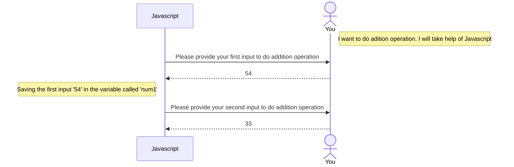

# Addition program using variable

Now we are going to do a interactive programming. As a user you will give input. The program will process the input and give output.

followin sequence diaram will explain what are we going to do.

