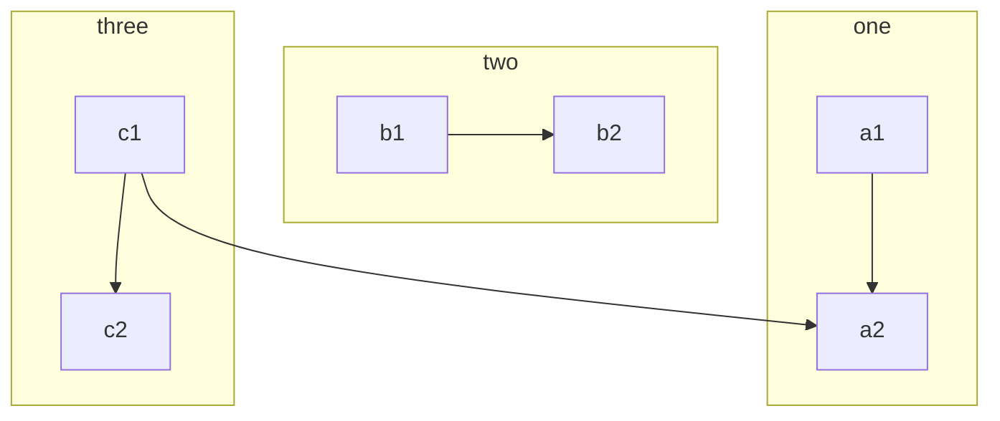

# First program

## Why Javascript

In case of any other programming language, you need to install some softwares and configure it to up and run that program.
 But using a readily available environment settup without any delay we can start programming with javascript
## Required things to do this program

A computer with one of the Chromium-based web browser like Google Chrome, Brave, Opera, Vivaldi and Microsoft Edge. I am using chrome.
But the browser listed above will look like same so you can use anything to write code.

## Open developer tools available inside browser


- Open your browser. I have opened my google chrome.
- Top right corner of the browser, Click menu options icon "Vertical three dots"
- Select "More tools" in the menu
- Submenu will open, Select Developer tools.

:::tip Keyboard Shortcut

You can use keyboard Shortcut to open browser's developer tools.
####
**Ctrl + Shift + I (or) F12**

:::

## Code editor "snippets" available inside developer tools


- Click "Sources" tab at top row.
- Click "double arrow icon" at left vertical area
- Select "Snippets"
- Snippets page loaded.

### Create a new code snippet


- Click on "New snippet"
- Give snippet name "first"

### Typing and Executing First Program


```jsx title="first.js"
alert('Hello world!');
```
- Type your first program "alert(\'Hello world!\');"
- Execute your first program by clicking play button at bottom right

### Output
We will get alert popup from browser saying "Hello world!".


We successfully executed our first program.

